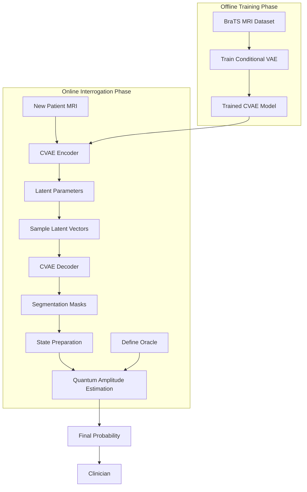

```mermaid
graph TD
    subgraph Offline["Offline Training Phase"]
        DATA["BraTS MRI Dataset"] --> TRAIN["Train Conditional VAE"]
        TRAIN --> MODEL["Trained CVAE Model"]
    end

    subgraph Online["Online Interrogation Phase"]
        NEW_MRI["New Patient MRI"] --> ENCODER["CVAE Encoder"]
        MODEL --> ENCODER
        ENCODER --> LATENT["Latent Parameters"]
        LATENT --> SAMPLER["Sample Latent Vectors"]
        SAMPLER --> DECODER["CVAE Decoder"]
        DECODER --> MASKS["Segmentation Masks"]
        
        ORACLE_DEF["Define Oracle"]
        MASKS --> STATE_PREP["State Preparation"]
        STATE_PREP --> QAE_ALG["Quantum Amplitude Estimation"]
        ORACLE_DEF --> QAE_ALG
    end

    QAE_ALG --> FINAL_PROB["Final Probability"]
    FINAL_PROB --> USER["Clinician"]

```